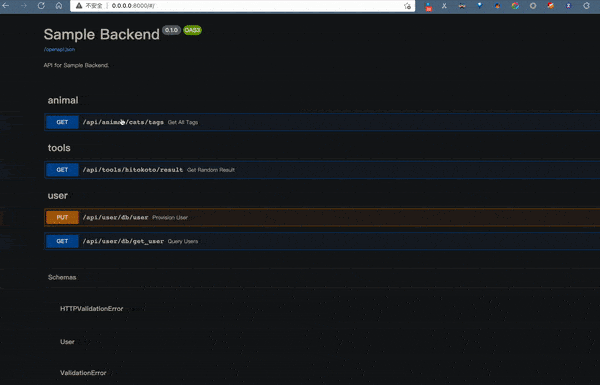

# fastapi-app-sample

Make an out-of-the-box backend based on FastAPI

```bash
FastAPI + MySQL + Requests+ alembic + SQLmodel + aiohttp + sqlalchemy
```


### Project screen shoot


### Project API doc

```bash
http://0.0.0.0:8000
```

### Tree view
```bash
.
├── Dockerfile
├── LICENSE
├── README.md
├── alembic
│   ├── README
│   ├── env.py
│   ├── script.py.mako
│   └── versions
├── alembic.ini
├── app
│   ├── client
│   │   ├── cats_client.py
│   │   ├── hitokoto_client.py
│   │   └── http.py
│   ├── db
│   │   ├── crud.py
│   │   ├── database.py
│   │   └── init.py
│   ├── models
│   │   ├── __init__.py
│   │   └── models.py
│   ├── router
│   │   ├── animal.py
│   │   ├── api.py
│   │   ├── db.py
│   │   └── tools.py
│   ├── test
│   │   └── test_animal.py
│   └── utils
│       ├── log_init.py
│       └── logging_config.json
├── config.ini
├── docker
│   ├── build.sh
│   └── run.sh
├── handler.py
├── logs
│   └── access.log
├── main.py
├── migration
├── pip.conf
├── requirements.txt
└── sample.gif
```

## Database

Offical
docs: [https://alembic.sqlalchemy.org/en/latest/tutorial.html](https://alembic.sqlalchemy.org/en/latest/tutorial.html)

### Init

```bash
alembic init alembic
```

### Editing the alembic.ini File

```bash
 Please edit configuration/connection/logging settings in './fastapi-app-sample/alembic.ini' before proceeding
```

### Create a Migration Script

```bash
alembic revision -m "create account table"
Generating /path/to/yourproject/alembic/versions/1975ea83b712_create_accoun
t_table.py...done
```

## Docker

### how to build images

```bash
sh docker/build.sh
```

## how to run

```bash
sh docker/run.sh
```

## References

- [https://fastapi.tiangolo.com/tutorial/](https://fastapi.tiangolo.com/tutorial/)
- [https://sqlmodel.tiangolo.com/](https://sqlmodel.tiangolo.com/)
- [https://docs.aiohttp.org/en/stable/](https://docs.aiohttp.org/en/stable/)
- [https://github.com/Delgan/loguru](https://github.com/Delgan/loguru)
- [https://docs.python-requests.org/en/master/](https://docs.python-requests.org/en/master/)
- [https://docs.sqlalchemy.org/en/14/](https://docs.sqlalchemy.org/en/14/)
- [https://github.com/alembic/alembic](https://github.com/alembic/alembic)